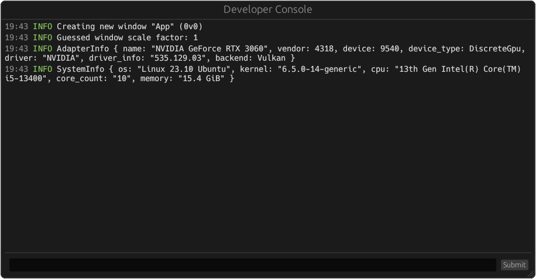

# bevy_dev_console

`bevy_dev_console` is a Source-inspired developer console plugin for the [Bevy Game Engine](https://github.com/bevyengine/bevy).



> [!WARNING]  
> `bevy_dev_console` is currently in its early development stages. Expect breaking changes in the near future (especially when using the built-in command parser). For this reason its only available as a git package at the moment.

## Features

- Log viewing
  - View all the hidden data from any log message by hovering over it.
- Powerful Built-in parser language built specifically for `bevy_dev_console`. ([Documentation](https://github.com/doonv/bevy_dev_console/wiki/Built%E2%80%90in-Parser))
  - Calculations
  - Variables
    - Uses a simplified version of ownership and borrowing
  - Standard library (Doesn't have much at the moment)
  - [Custom native functions](https://github.com/doonv/bevy_dev_console/blob/master/examples/custom_functions.rs) (`World` access included!)
  - [Many types](https://github.com/doonv/bevy_dev_console/wiki/Built%E2%80%90in-Parser#types)
  - Resource viewing and modification
    - Enums
    - Structs
  - ~~Entity queries~~ [*Coming Soon...*](https://github.com/doonv/bevy_dev_console/issues/3) (Syntax suggestions would be appreciated!)
  - ...and more!

## Usage

1. Add the `bevy_dev_console` git package.

    ```bash
    cargo add --git https://github.com/doonv/bevy_dev_console.git
    ```

2. Import the `prelude`.

    ```rust
    use bevy_dev_console::prelude::*;
    ```

3. Add the plugins.

    ```rust,no_run
    use bevy::{prelude::*,log::LogPlugin};
    use bevy_dev_console::prelude::*;

    App::new()
        .add_plugins((
            // Start capturing logs before the default plugins initiate.
            ConsoleLogPlugin::default(),
            // Add the default plugins without the LogPlugin.
            // Not removing the LogPlugin will cause a panic!
            DefaultPlugins.build().disable::<LogPlugin>(),
            // Add the dev console plugin itself.
            DevConsolePlugin,
        ))
        .run();
    ```

4. That should be it! You can now press the `` ` `` / `~` key on your keyboard and it should open the console!

## Togglable Features

**(default)** `builtin-parser` includes the default parser. Disabling this allows you to remove the built-in parser and replace it with your own (or you could do nothing and make the console into a log reader).

## Bevy Compatibility

| bevy   | bevy_dev_console |
| ------ | ---------------- |
| 0.12.* | git (master)     |
